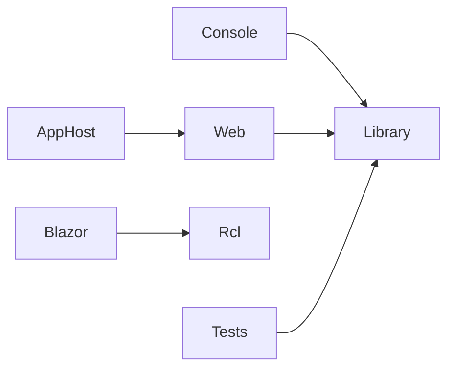

# Architecture notes

Plain Markdown outside of any project. Used to check that Repo view shows documentation folders
and that Markdown preview / navigation works for non-solution files.

```mermaid
flowchart LR
  Console --> Library
  Web --> Library
  Blazor --> Rcl
  AppHost --> Web
  Tests --> Library
```
